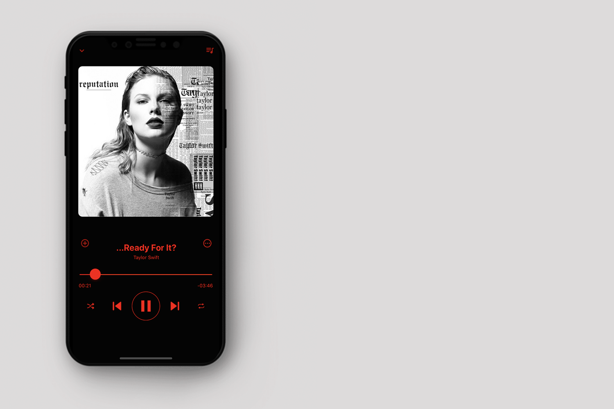

# QuinPod
A sleek and powerful music player built with React Native

## Installation
- Clone the repository and run `react-native init`
- Then run `react-native run-ios` to build and run the application

## Design
- Inspired by [Spotify Music]()

## TODO
- This application is currently supported only on iOS platforms
- Android version is currently being developed
